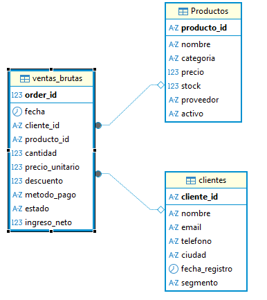
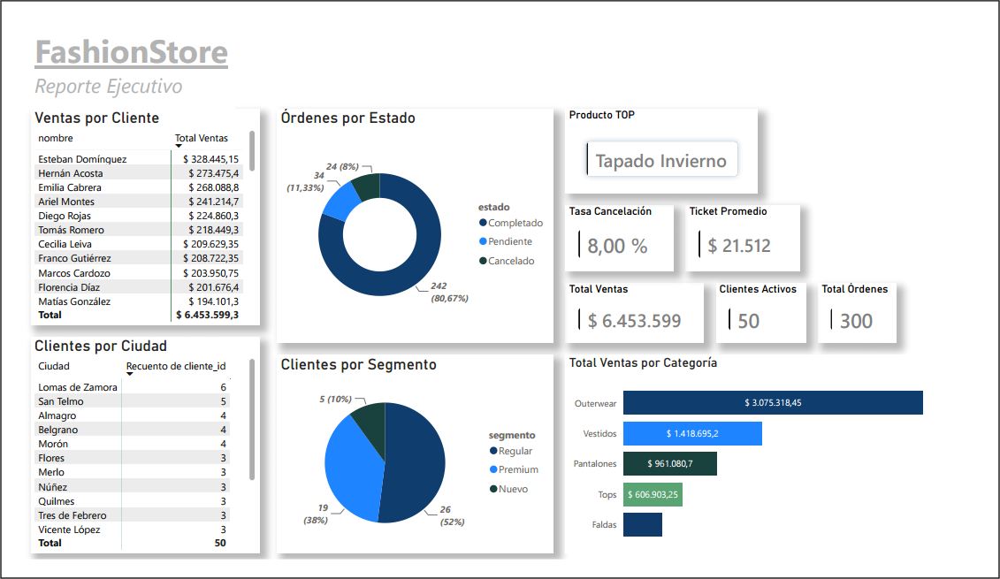
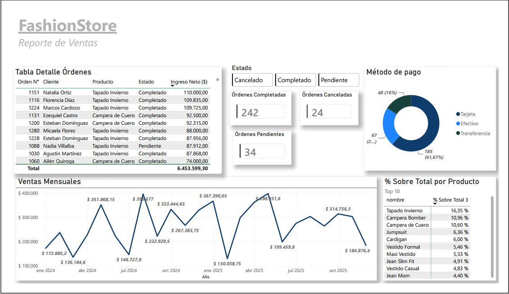

# FashionStore | Business Intelligence para E-commerce con PostgreSQL, Power Query y Power BI

Proyecto completo de Business Intelligence desarrollado sobre un conjunto de datos de comercio electrónico. El pipeline integra **PostgreSQL, Power Query y Power BI** para transformar datos operacionales en un modelo analítico preparado para la toma de decisiones comerciales.

---

# Descripción del Proyecto

FashionStore muestra el flujo de trabajo de un equipo de Business Intelligence dentro de una empresa de e-commerce.

Este proyecto distribuye el procesamiento entre **SQL y Power Query**, mientras que el **modelo analítico y las métricas de negocio se desarrollan mediante DAX en Power BI**.

El objetivo es demostrar capacidades de:

- Extracción de datos desde múltiples archivos CSV
- Limpieza y normalización de datos
- Transformación mediante SQL y Power Query
- Modelado relacional
- Desarrollo de métricas DAX
- Construcción de dashboards interactivos para análisis comercial

---

# Arquitectura del Pipeline

El flujo implementado combina procesamiento estructurado en PostgreSQL y transformación analítica dentro del ecosistema Power BI.

```text
CSV / Excel (Archivos Brutos)
           │
           ▼
PostgreSQL (STAGING)
           │
           ▼
Limpieza y Validación SQL
           │
           ▼
PostgreSQL (CORE / PRODUCCIÓN)
           │
           ▼
Power Query (M)
           │
           ▼
Modelo Relacional en Power BI
           │
           ▼
Medidas DAX
           │
           ▼
Dashboards Interactivos
```

La arquitectura separa claramente los datos originales de los datos preparados para análisis. El esquema **staging** preserva la información importada desde los archivos fuente, mientras que el esquema **core** almacena el modelo relacional validado utilizado por Power BI. Sobre esa base se desarrollan transformaciones adicionales en **Power Query** y métricas de negocio mediante **DAX**, permitiendo construir dashboards interactivos y análisis comerciales avanzados.

---

# Organización de Esquemas

El proyecto utiliza una separación clara entre datos de origen y datos preparados.

## staging

Contiene los archivos importados sin restricciones.

- Conservación del dato original
- Diagnóstico de calidad
- Preparación para transformaciones
- Trazabilidad del proceso ETL

## core

Almacena el modelo relacional utilizado por Power BI.

- Integridad referencial
- Claves primarias y foráneas
- Tipos de datos corregidos
- Base para el modelo analítico

---

# Modelo de Datos

<p align="center">
  
</p>

El modelo integra información de:

- Clientes
- Productos
- Categorías
- Órdenes
- Items de órdenes
- Pagos
- Reseñas
- Vendedores

Las relaciones permiten análisis por cliente, categoría, vendedor, ubicación geográfica y evolución temporal.

---

# Implementación SQL

Ejemplo representativo de la creación del modelo de producción.

## Tabla `core.ventas`

```sql
insert into ventas
SELECT 
    sv.order_id::INTEGER,
    CASE 
        -- 1. LIMPIEZA EXTRAORDINARIA: Corrige la letra 'O' por un cero '0' si viene al final de la fecha
        WHEN TRIM(sv.fecha) ~ '^\d{4}-\d{2}-2O$' 
            THEN TO_DATE(REPLACE(TRIM(sv.fecha), '2O', '20'), 'YYYY-MM-DD')

        -- 2. Formato: 01 Oct 2025 (Día Mes_Texto Año)
        WHEN TRIM(sv.fecha) ~ '^\d{2}\s[A-Za-z]{3}\s\d{4}' 
            THEN TO_DATE(TRIM(sv.fecha), 'DD Mon YYYY')

        -- 3. Formato: Apr 20 2024 (Mes_Texto Día Año)
        WHEN TRIM(sv.fecha) ~ '^[A-Za-z]{3}\s\d{2}\s\d{4}' 
            THEN TO_DATE(TRIM(sv.fecha), 'Mon DD YYYY')

        -- 4. Formato estándar: 2026-07-07 o 2026/07/07
        WHEN TRIM(sv.fecha) ~ '^\d{4}[-/]\d{2}[-/]\d{2}' 
            THEN TO_DATE(TRIM(sv.fecha), 'YYYY-MM-DD')
        
        -- 5. Formato clásico: 07-07-2026 o 07/07/2026
        WHEN TRIM(sv.fecha) ~ '^\d{2}[-/]\d{2}[-/]\d{4}' 
            THEN TO_DATE(TRIM(sv.fecha), 'DD-MM-YYYY')

        -- 6. Formato con puntos: 15.02.2024
        WHEN TRIM(sv.fecha) ~ '^\d{2}\.\d{2}\.\d{4}' 
            THEN TO_DATE(TRIM(sv.fecha), 'DD.MM.YYYY')
        
        -- 7. Formato corto: 07/07/26
        WHEN TRIM(sv.fecha) ~ '^\d{2}[-/]\d{2}[-/]\d{2}$' 
            THEN TO_DATE(TRIM(sv.fecha), 'DD-MM-YY')

        -- 8. Formato con hora incorporada: 2026-07-07 10:51:00
        WHEN TRIM(sv.fecha) ~ '^\d{4}-\d{2}-\d{2} \d{2}:\d{2}' 
            THEN CAST(TRIM(sv.fecha) AS TIMESTAMP)::DATE

        -- Mantenemos el NULL de seguridad por si en el futuro entra un formato nuevo
        ELSE NULL 
    END AS fecha_limpia,
    sv.cliente_id, 
    sv.producto_id, 
    sv.cantidad::INTEGER,
    sv.precio_unitario::NUMERIC(10,2), 
    sv.descuento::NUMERIC(4,2), 
    INITCAP(sv.metodo_pago), 
    INITCAP(sv.estado)
FROM staging_ventas sv
WHERE cliente_id IN (SELECT cliente_id FROM clientes)
  AND producto_id IN (SELECT producto_id FROM productos);
```

## Vista utilizada por Power BI

```sql
CREATE OR REPLACE VIEW v_tendencia_mensual AS
WITH base AS (
    SELECT
        DATE_TRUNC('month', fecha)  AS mes,
        SUM(ingreso_neto)           AS ventas_mes,
        COUNT(*)                    AS ordenes_mes
    FROM ventas
    GROUP BY DATE_TRUNC('month', fecha)
)
SELECT
    TO_CHAR(mes, 'Mon YYYY')        AS periodo,
    ventas_mes,
    ordenes_mes,
    SUM(ventas_mes) OVER (ORDER BY mes) AS ventas_acumuladas,
    ROUND(
        (ventas_mes - LAG(ventas_mes) OVER (ORDER BY mes)) * 100.0 /
        NULLIF(LAG(ventas_mes) OVER (ORDER BY mes), 0), 2
    )                               AS variacion_mom_pct
FROM base
ORDER BY mes;
```

---

# Transformaciones en Power Query

Una parte importante del pipeline analítico se desarrolla mediante **Power Query (M)**.

Principales transformaciones implementadas:

- Conversión y validación de tipos de datos
- Limpieza de valores nulos
- Estandarización de categorías
- Combinación de tablas mediante Merge
- Expansión de tablas relacionadas
- Creación de columnas derivadas
- Optimización del modelo para Power BI

El objetivo fue reducir complejidad en el modelo analítico y preparar datos consistentes para las medidas DAX.

---

# Modelo Analítico y Medidas DAX

FashionStore incorpora lógica de negocio directamente en Power BI.

Ejemplos representativos:

```DAX
Ventas MoM % = 
VAR MesActual = [Total Ventas]
VAR MesAnterior = CALCULATE([Total Ventas], DATEADD(ventas_brutas[fecha], -1, MONTH))
RETURN DIVIDE(MesActual - MesAnterior, MesAnterior)

% Sobre Total 3 = 
VAR VentasProducto = [Total Ventas]
VAR VentasTotal = CALCULATE([Total Ventas], ALL(ventas_brutas))
RETURN DIVIDE(VentasProducto, VentasTotal)

Ventas MTD = 
TOTALMTD([Total Ventas], ventas_brutas[fecha])
```

Estas medidas permiten análisis dinámicos por período, categoría de producto, segmento de cliente, estado de la orden y ubicación geográfica.

---

# Dashboards

El proyecto incluye **dos dashboards complementarios** orientados al análisis ejecutivo y operativo de un negocio de comercio electrónico.

<p align="center">
  
</p>

### Dashboard Ejecutivo

Enfocado en indicadores estratégicos y comportamiento comercial.

Indicadores principales:

- Ventas totales
- Ticket promedio
- Clientes activos
- Total de órdenes
- Tasa de cancelación
- Producto con mayor facturación
- Ventas por categoría
- Clientes por segmento
- Clientes por ciudad
- Distribución de órdenes por estado

<p align="center">
  
</p>

### Dashboard de Ventas

Orientado al seguimiento operativo y análisis temporal.

Indicadores principales:

- Detalle de órdenes
- Órdenes por estado
- Método de pago
- Tendencia mensual de ventas
- Participación de ventas por producto
- Evolución temporal del ingreso neto

# Estructura del Proyecto

```text
FashionStore/
│
├── Archivos_Bruto/
│   ├── clientes.csv
│   ├── Productos.xlsx
│   ├── ventas_brutas.csv
│
├── Script/
│   ├── limpieza_datos_fashionstore.sql
│
├── Docs/
│   ├── 01_Arquitectura.md
│   ├── 02_Modelo_de_Datos.md
│   ├── 03_Dashboard_y_Resultados.md
│
├── Images/
│   ├── dashboard_01.png
│   ├── dashboard_02.png
│   ├── modelo_datos.png
│
└── README.md
```

---

# Documentación Técnica

El proyecto incluye documentación completa del pipeline.

| Documento | Contenido |
|-----------|-----------|
| 01_Arquitectura | Flujo ETL y arquitectura técnica |
| 02_Modelo_de_Datos | Diseño relacional |
| 03_Dashboard_y_Resultados | Indicadores y visualizaciones |

---

# Tecnologías Utilizadas

- PostgreSQL
- SQL
- Power BI
- Power Query (M)
- DAX
- Excel / CSV
- Git
- GitHub

---

# Autor

**Julián Olaviaga**

Especialista en preparación y procesamiento de datos para Business Intelligence.

- GitHub: https://github.com/juliangolaviaga-data
- LinkedIn: https://www.linkedin.com/in/julian-olaviaga-0b9329385/
- Workana: https://www.workana.com/freelancer/ec9769ac6e5b2321c25e71f03e372a13