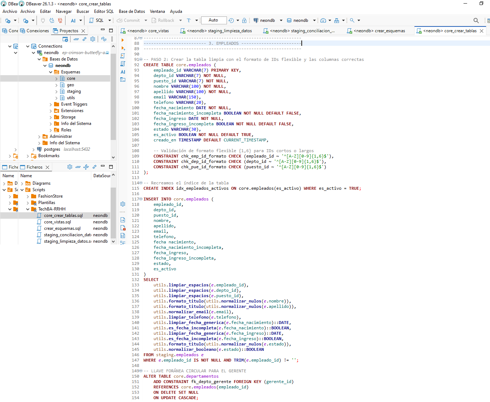
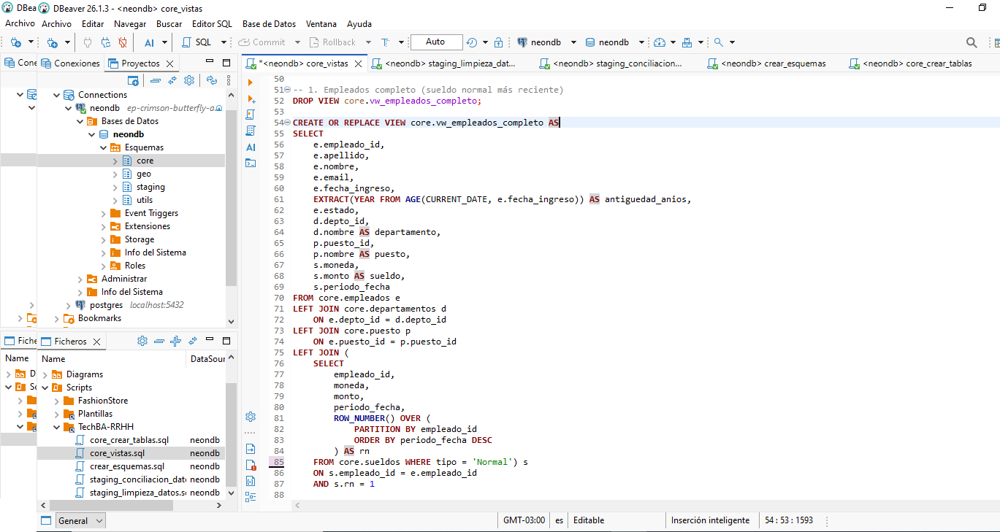

---

# 📋 Descripción del Proyecto

TECHBA es un proyecto de Business Intelligence que demuestra el desarrollo completo de un pipeline de datos para el área de Recursos Humanos.

El proyecto abarca todo el flujo de procesamiento, desde la importación de archivos de origen hasta la generación de dashboards interactivos en Power BI, aplicando procesos de limpieza, validación, modelado relacional y preparación de datos en PostgreSQL.

La arquitectura está diseñada bajo un enfoque **SQL First**, centralizando la lógica de negocio dentro de la base de datos mediante tablas de producción y vistas SQL reutilizables, permitiendo que Power BI se utilice exclusivamente como herramienta de visualización y análisis.

---

# 🚀 Plataforma

| Componente | Tecnología |
|------------|------------|
| Base de datos | Neon PostgreSQL |
| Motor SQL | PostgreSQL |
| Visualización | Power BI |
| Control de versiones | Git |
| Repositorio | GitHub |
---

# 🛠️ Tecnologías y Conceptos Aplicados

- ETL
- Data Cleaning
- Data Validation
- Modelado Relacional
- SQL Views
- Business Intelligence
- Arquitectura SQL First

---

# 📊 Resumen del Proyecto

| Métrica | Valor |
|---------|------:|
| **Tablas de origen** | 6 |
| **Registros procesados** | ~7.350 |
| **Esquemas de la base de datos** | 4 |
| **Tablas de producción** | 6 |
| **Vistas SQL** | 6 |
| **Páginas del Dashboard** | 2 |
| **Documentos técnicos** | 9 |

---

# 🏗️ Arquitectura del Pipeline

El proyecto implementa un pipeline de datos organizado en capas, donde cada etapa cumple una responsabilidad específica dentro del proceso de preparación de la información.

El flujo comienza con la importación de los archivos de origen hacia un entorno de trabajo (*staging*), continúa con las tareas de limpieza, validación y transformación de los datos, para luego consolidar un modelo relacional de producción (*core*). Finalmente, las vistas SQL sirven como fuente única de información para Power BI, evitando duplicar lógica de negocio en la herramienta de visualización.

<p align="center">
  
</p>

---

# 🗂️ Organización de la Base de Datos

La base de datos se encuentra organizada en esquemas independientes para separar responsabilidades y facilitar el mantenimiento del proyecto.

| Esquema | Descripción |
|----------|-------------|
| **staging** | Área de trabajo donde se importan, limpian y validan los datos provenientes de los archivos de origen. |
| **core** | Contiene el modelo relacional definitivo, las tablas de producción y las vistas SQL utilizadas por Power BI. |
| **utils** | Biblioteca de funciones y utilidades SQL reutilizables desarrolladas durante el proyecto. |
| **geo** | Esquema generado por PostGIS que almacena metadatos espaciales del sistema. No participa del flujo analítico. |

---

# 🔄 Flujo del Pipeline

```text
Archivos de origen
        │
        ▼
 Importación de datos
        │
        ▼
  Esquema staging
        │
        ▼
Limpieza y validación
        │
        ▼
 Transformación SQL
        │
        ▼
   Esquema core
        │
        ▼
    Vistas SQL
        │
        ▼
     Power BI
        │
        ▼
 Dashboards Analíticos
```
---

# 📊 Dashboard

El dashboard fue desarrollado en Power BI utilizando como única fuente de datos las vistas SQL del esquema **core**.

Toda la lógica de transformación y preparación de los datos se implementó previamente en PostgreSQL, permitiendo que Power BI se utilice exclusivamente para la exploración visual y el análisis de indicadores.

<p align="center">
    
</p>

<p align="center">
    
</p>

---

# 🗄️ Modelo de Datos

El modelo relacional fue diseñado para garantizar la integridad de la información mediante claves primarias, claves foráneas y relaciones normalizadas.

La separación entre las tablas de trabajo (*staging*) y las tablas de producción (*core*) permite mantener un proceso de carga y transformación organizado, reutilizable y fácil de mantener.

<p align="center">
    
</p>

---

# 💻 Implementación SQL

Una de las principales decisiones de arquitectura del proyecto fue centralizar la lógica de negocio dentro de PostgreSQL.

Los scripts SQL están organizados por etapas del pipeline (creación de esquemas, limpieza, conciliación, modelado y vistas analíticas), permitiendo un proceso reproducible, reutilizable y fácil de mantener.

### Script de creación de `core.empleados`

La siguiente imagen muestra el **script SQL completo** utilizado para crear la tabla `core.empleados`, una de las entidades principales del modelo relacional de producción.

<p align="center">
  
</p>

### Vista `vw_empleados_completo`

La siguiente imagen muestra la vista analítica `vw_empleados_completo`, utilizada directamente por Power BI como una de las fuentes de datos del dashboard.

<p align="center">
  
</p>

Las vistas SQL del esquema **core** exponen información lista para el análisis, manteniendo la lógica de negocio centralizada en PostgreSQL y simplificando el modelo de Power BI.

---

# 📁 Estructura del Proyecto

La estructura del proyecto está organizada para separar los archivos de origen, los scripts SQL, la documentación técnica y los recursos visuales utilizados durante el desarrollo del pipeline.

```text
techba-rrhh/
│
├── Archivos_Bruto/
│
├── Script/
│   ├── crear_esquemas.sql
│   ├── staging_limpieza_datos.sql
│   ├── staging_conciliacion_datos.sql
│   ├── core_crear_tablas.sql
│   └── core_vistas.sql
│
├── Docs/
│   ├── 01_Resumen_Ejecutivo.md
│   ├── 02_Problema_de_Negocio.md
│   ├── 03_Arquitectura.md
│   ├── 04_Modelo_de_Datos.md
│   ├── 05_Preparacion_y_Calidad_de_Datos.md
│   ├── 06_Registro_de_Incidencias.md
│   ├── 07_Dashboard_y_Resultados.md
│   ├── 08_Decisiones_de_Arquitectura.md
│   └── 09_Mejoras_Futuras.md
│
├── Images/
│   ├── arquitectura.png
│   ├── arquitectura.svg
│   ├── dashboard_01.png
│   ├── dashboard_02.png
│   ├── modelo_datos.png
│   ├── sql_view_01.png
│   └── sql_view_02.png
│
└── README.md
```

> Nota: las funciones SQL reutilizables utilizadas durante el desarrollo se mantienen en un repositorio independiente de librerías y no forman parte de este repositorio.

---

# 📚 Documentación Técnica

El proyecto incluye documentación técnica detallada que describe cada etapa del desarrollo, desde la definición del problema hasta las decisiones de arquitectura implementadas.

| Documento | Descripción |
|-----------|-------------|
| [01_Resumen_Ejecutivo.md](Docs/01_Resumen_Ejecutivo.md) | Resumen general del proyecto y sus objetivos. |
| [02_Problema_de_Negocio.md](Docs/02_Problema_de_Negocio.md) | Contexto y necesidad analítica del área de Recursos Humanos. |
| [03_Arquitectura.md](Docs/03_Arquitectura.md) | Diseño de la arquitectura del pipeline y organización del flujo de datos. |
| [04_Modelo_de_Datos.md](Docs/04_Modelo_de_Datos.md) | Modelo relacional, esquemas y relaciones entre entidades. |
| [05_Preparacion_y_Calidad_de_Datos.md](Docs/05_Preparacion_y_Calidad_de_Datos.md) | Procesos de limpieza, estandarización y validación de datos. |
| [06_Registro_de_Incidencias.md](Docs/06_Registro_de_Incidencias.md) | Problemas encontrados y soluciones aplicadas durante el desarrollo. |
| [07_Dashboard_y_Resultados.md](Docs/07_Dashboard_y_Resultados.md) | Métricas, visualizaciones y resultados obtenidos. |
| [08_Decisiones_de_Arquitectura.md](Docs/08_Decisiones_de_Arquitectura.md) | Justificación de las principales decisiones técnicas del proyecto. |
| [09_Mejoras_Futuras.md](Docs/09_Mejoras_Futuras.md) | Posibles extensiones y evolución futura del pipeline. |

---

# 👨‍💻 Autor

**Julián Olaviaga**

Especialista en procesamiento y análisis de datos, enfocado en arquitectura SQL, PostgreSQL y preparación de datos para Business Intelligence.

- GitHub: https://github.com/juliangolaviaga-data
- LinkedIn: *(agregar enlace cuando esté actualizado)*

---

<p align="center">
  <b>TECHBA — Human Resources Data Pipeline</b><br>
  Arquitectura SQL First • PostgreSQL • Neon • Power BI
</p>